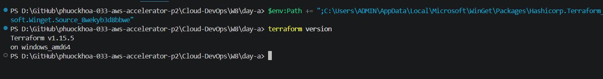
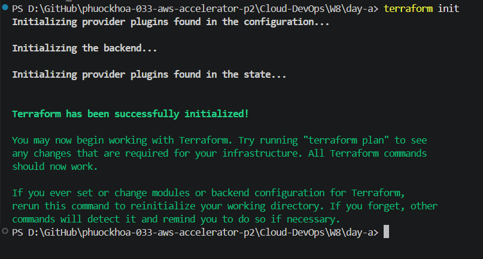
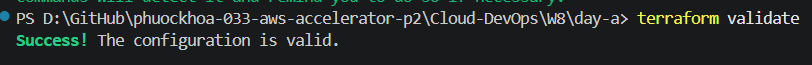
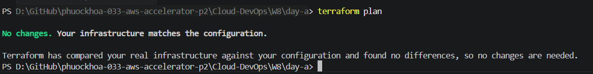
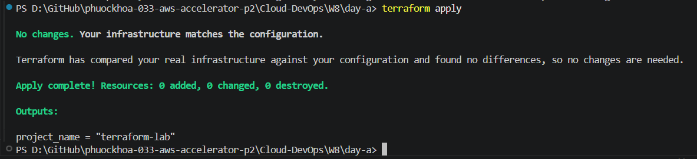
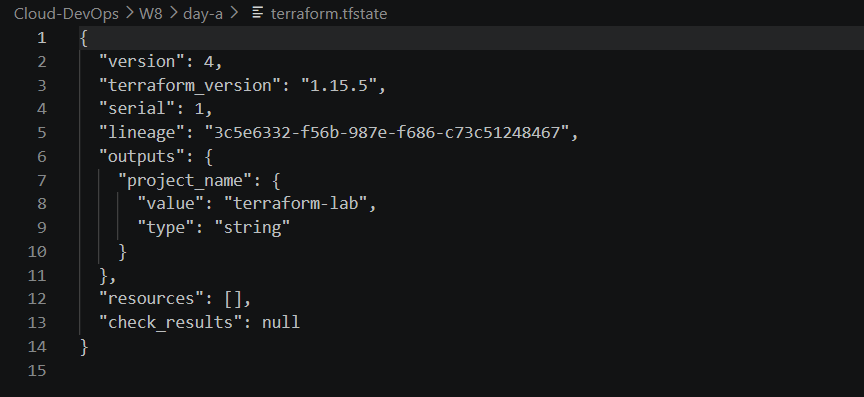

# W8 Day 1 Evidence - Terraform Fundamentals

## 1. Terraform Installation

### Command

```bash
terraform version
```

### Result

Terraform v1.15.5 installed successfully on Windows.

### Screenshot



---

## 2. Terraform Initialization

### Command

```bash
terraform init
```

### Result

Terraform initialized successfully.

### Screenshot



---

## 3. Configuration Validation

### Command

```bash
terraform validate
```

### Result

Success! The configuration is valid.

### Screenshot



---

## 4. Terraform Plan

### Command

```bash
terraform plan
```

### Result

Terraform generated an execution plan successfully.

### Screenshot



---

## 5. Terraform Apply

### Command

```bash
terraform apply
```

### Result

Terraform applied successfully.

### Screenshot



---

## 6. Terraform State File

### File

terraform.tfstate

### Screenshot

