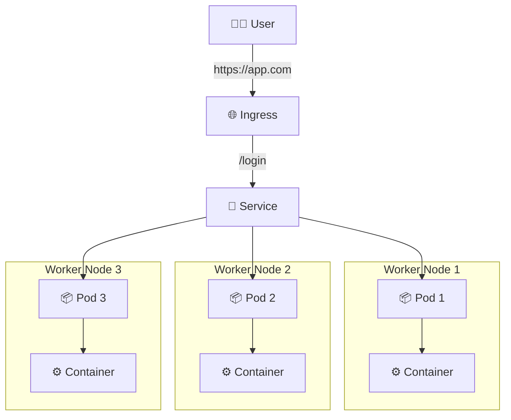

# W8 Day B - Tổng Hợp Kiến Thức Kubernetes Chi Tiết

Đây là tài liệu giải thích chi tiết các khái niệm cốt lõi của Kubernetes, được biên soạn lại từ ghi chú của bạn.

---

## 🔷 1. Kubernetes là gì?

Kubernetes (thường được gọi là K8s) là một hệ thống **điều phối container** (Container Orchestration) mã nguồn mở mạnh mẽ. Nó được phát triển ban đầu bởi Google và hiện được duy trì bởi Cloud Native Computing Foundation (CNCF).

Nhiệm vụ chính của nó không phải là để *chạy* container (đó là việc của Container Runtime như Docker), mà là để *quản lý* một đội quân container một cách hiệu quả trên quy mô lớn.

### Nhiệm vụ chính:

-   **Triển khai Container (Deploy):** Tự động hóa việc triển khai các ứng dụng được đóng gói trong container lên một cụm máy chủ (cluster).
-   **Tự động co giãn (Scaling):** Tự động tăng hoặc giảm số lượng container đang chạy dựa trên nhu cầu sử dụng (ví dụ: tải CPU tăng cao).
-   **Cân bằng tải (Load Balancing):** Phân phối lưu lượng mạng một cách thông minh đến các container để không có container nào bị quá tải và đảm bảo tính sẵn sàng cao.
-   **Tự phục hồi (Self-healing):** Tự động phát hiện và khởi động lại các container bị lỗi, thay thế các node không phản hồi, đảm bảo ứng dụng luôn ở trạng thái mong muốn.
-   **Quản lý Cấu hình & Bí mật (Configuration & Secret Management):** Cho phép bạn lưu trữ và quản lý các thông tin nhạy cảm và cấu hình ứng dụng một cách an toàn mà không cần build lại image.

> **🧠 Tóm lại:** Nếu **Docker** là công cụ giúp bạn *đóng gói và chạy một container* riêng lẻ, thì **Kubernetes** là người nhạc trưởng giúp bạn *quản lý hàng trăm, hàng nghìn container* đó cùng lúc, đảm bảo chúng hoạt động hài hòa như một dàn nhạc giao hưởng.

---

## 🔷 2. Kiến trúc Kubernetes (RẤT QUAN TRỌNG)

Một cụm Kubernetes (cluster) bao gồm hai thành phần chính: **Control Plane** (bộ não) và các **Worker Nodes** (công nhân).


### 2.1 Control Plane (Não bộ của hệ thống)

Control Plane chịu trách nhiệm đưa ra mọi quyết định toàn cục về cluster (ví dụ: lên lịch cho container, phát hiện sự kiện) và duy trì trạng thái mong muốn của hệ thống. Nó bao gồm các thành phần sau:

-   **🔹 kube-apiserver:** Là "cửa ngõ" của Control Plane. Mọi giao tiếp từ bên ngoài (ví dụ: từ lệnh `kubectl` của bạn) và từ bên trong cluster đều phải đi qua API Server. Nó xác thực yêu cầu, xử lý và thực thi chúng.
-   **🔹 etcd:** Là cơ sở dữ liệu key-value phân tán, đóng vai trò là "bộ nhớ" duy nhất và đáng tin cậy của cluster. Nó lưu trữ toàn bộ trạng thái của cluster, từ cấu hình, trạng thái của các object (Pod, Service,...) cho đến các thông tin bí mật. Mất `etcd` là mất cả cluster.
-   **🔹 kube-scheduler:** Có nhiệm vụ như một "nhà điều phối". Khi bạn yêu cầu tạo một Pod mới, Scheduler sẽ quét qua các Worker Node, đánh giá các yếu tố như tài nguyên sẵn có (CPU, RAM), các ràng buộc (constraints), và quyết định Node nào là nơi "hạ cánh" lý tưởng nhất cho Pod đó.
-   **🔹 kube-controller-manager:** Là một tập hợp các "quản lý viên" chuyên trách. Mỗi controller có một nhiệm vụ riêng và liên tục theo dõi trạng thái của cluster, cố gắng đưa trạng thái hiện tại về trạng thái mong muốn. Ví dụ:
    -   *Node Controller:* Theo dõi tình trạng của các Worker Node.
    -   *Replication Controller:* Đảm bảo số lượng Pod mong muốn luôn được duy trì.

### 2.2 Worker Node (Nơi công việc được thực thi)

Đây là các máy chủ (có thể là máy ảo hoặc vật lý) nơi các ứng dụng của bạn thực sự chạy. Mỗi Worker Node chứa các thành phần sau:

-   **🔹 kubelet:** Là "đại lý" của Control Plane trên mỗi Worker Node. Nó nhận chỉ thị từ `kube-apiserver` (ví dụ: "hãy chạy Pod này") và đảm bảo các container được mô tả trong Pod đó đang chạy và khỏe mạnh. Nó cũng báo cáo lại tình trạng của Node và các Pod trên đó về cho Control Plane.
-   **🔹 kube-proxy:** Là "nhà quản lý mạng" trên mỗi Node. Nó duy trì các quy tắc mạng (network rules) và thực hiện việc chuyển tiếp kết nối (connection forwarding) để cho phép giao tiếp mạng đến các Pod từ bên trong hoặc bên ngoài cluster. Nó là thành phần cốt lõi giúp Service hoạt động.
-   **🔹 Container Runtime:** Là phần mềm chịu trách nhiệm chạy container. Kubernetes tương thích với nhiều loại container runtime như **Docker**, **containerd**, **CRI-O**. `kubelet` sẽ ra lệnh cho Container Runtime để kéo image và chạy container.

---

## 🔷 3. Kubernetes Object (CỰC QUAN TRỌNG)

Trong Kubernetes, mọi thứ bạn tạo và quản lý đều là một **Object**. Các object này là các "thực thể bền vững" (persistent entities) trong hệ thống, đại diện cho trạng thái của cluster.

### 3.1 Cấu trúc cơ bản của một Object

Hầu hết các object trong Kubernetes đều có 4 trường chính trong file YAML định nghĩa:

-   `apiVersion`: Phiên bản của API Kubernetes bạn đang sử dụng để tạo object này (ví dụ: `v1`, `apps/v1`).
-   `kind`: Loại object bạn muốn tạo (ví dụ: `Pod`, `Deployment`, `Service`).
-   `metadata`: Dữ liệu giúp nhận dạng object một cách duy nhất, bao gồm `name` (tên object), `namespace`, và `labels`.
-   `spec` (Specification): Đây là nơi bạn định nghĩa **trạng thái mong muốn** (desired state) của object. Ví dụ, với một Deployment, `spec` sẽ chứa thông tin về image container, số lượng replicas,...

### 3.2 `spec` vs `status`

Đây là một khái niệm nền tảng của Kubernetes.

| Thành phần | Ý nghĩa                                                                                             |
| :--------- | :-------------------------------------------------------------------------------------------------- |
| **`spec`** | **Trạng thái mong muốn** - Do người dùng định nghĩa. Bạn nói cho Kubernetes biết bạn *muốn* gì.        |
| **`status`** | **Trạng thái thực tế** - Do Kubernetes tự động cập nhật. Kubernetes báo cáo lại cho bạn *hiện tại* nó như thế nào. |

👉 **Nguyên tắc vàng của Kubernetes:** Nó luôn làm việc không mệt mỏi để đưa `status` (thực tế) khớp với `spec` (mong muốn). Khi bạn `kubectl apply`, bạn đang cập nhật `spec`, và Control Plane sẽ làm phần còn lại.

---

## 🔷 4. Pod (Đơn vị nhỏ nhất)

### 4.1 Pod là gì?

-   Là đơn vị nhỏ nhất có thể được tạo và quản lý trong Kubernetes.
-   Nó đại diện cho một "tiến trình" (process) đang chạy trong cluster.
-   Một Pod đóng gói một hoặc nhiều container (ví dụ: một container chính và một container phụ trợ - sidecar), cùng với các tài nguyên dùng chung như storage và network.

### 4.2 Đặc điểm

-   **Có IP riêng:** Mỗi Pod được cấp một địa chỉ IP duy nhất trong cluster, cho phép các container trong cùng một Pod giao tiếp với nhau qua `localhost`.
-   **Vòng đời ngắn ngủi (Ephemeral):** Pod được thiết kế để có thể "chết". Chúng không tự phục hồi. Khi một Pod chết, nó sẽ biến mất. Chính vì vậy, bạn không nên tạo Pod trực tiếp mà nên dùng các controller cấp cao hơn như Deployment để quản lý chúng.

### 4.3 Ví dụ

File `pod.yaml` đơn giản để chạy một container NGINX:

```yaml
apiVersion: v1
kind: Pod
metadata:
  name: nginx-pod
spec:
  containers:
  - name: nginx-container
    image: nginx:latest
```

---

## 🔷 5. Deployment (QUAN TRỌNG NHẤT)

### 5.1 Deployment là gì?

Deployment là một controller cấp cao hơn, cung cấp khả năng quản lý **khai báo** (declarative) cho Pod. Thay vì quản lý từng Pod riêng lẻ, bạn chỉ cần nói với Deployment bạn muốn có bao nhiêu bản sao của một Pod, và Deployment sẽ làm phần còn lại.

### 5.2 Chức năng chính

-   **Quản lý Replicas:** Đảm bảo rằng một số lượng Pod (replicas) nhất định luôn chạy. Nếu một Pod chết, Deployment sẽ tự động tạo một Pod mới để thay thế.
-   **Tự phục hồi (Self-healing):** Đây chính là cơ chế tự phục hồi của Kubernetes. Deployment liên tục so sánh trạng thái thực tế với trạng thái mong muốn và hành động để khắc phục sai lệch.
-   **Cập nhật ứng dụng (Rolling Update):** Cho phép bạn cập nhật ứng dụng lên phiên bản mới một cách an toàn, không gây gián đoạn dịch vụ. Deployment sẽ từ từ thay thế các Pod cũ bằng các Pod mới, và có thể tự động rollback nếu phiên bản mới gặp lỗi.

### 5.3 Ví dụ

Trong `spec` của Deployment, bạn định nghĩa `replicas: 3`. Điều này ra lệnh cho Deployment: "Hãy đảm bảo rằng luôn có 3 Pod khớp với template này đang chạy."

```yaml
apiVersion: apps/v1
kind: Deployment
metadata:
  name: nginx-deployment
spec:
  replicas: 3 # Trạng thái mong muốn
  selector:
    matchLabels:
      app: nginx
  template: # Khuôn mẫu để tạo Pod
    metadata:
      labels:
        app: nginx
    spec:
      containers:
      - name: nginx
        image: nginx:1.21
```

---

## 🔷 6. Service (Networking)

### 6.1 Vấn đề cần giải quyết

Như đã nói, Pod có vòng đời ngắn và IP của chúng liên tục thay đổi khi chúng được tạo lại. Vậy làm sao các Pod khác hoặc người dùng bên ngoài có thể kết nối đến ứng dụng của bạn một cách ổn định?

### 6.2 Giải pháp: Service

Service là một object cung cấp một "điểm cuối" (endpoint) mạng ổn định và trừu tượng cho một nhóm các Pod.

-   Nó có một **IP cố định** (gọi là ClusterIP) và một **DNS name** cố định trong cluster.
-   Nó sử dụng **Labels & Selectors** để tìm ra nhóm các Pod mà nó cần chuyển lưu lượng đến.
-   Khi một request đến Service, `kube-proxy` sẽ thông minh chuyển tiếp request đó đến một trong các Pod khỏe mạnh phía sau.

### 6.3 Các loại Service

| Loại          | Mục đích                                                                                             |
| :------------ | :--------------------------------------------------------------------------------------------------- |
| **ClusterIP** | (Mặc định) Chỉ expose Service trên một IP nội bộ trong cluster. Các Pod khác có thể truy cập nhưng không thể truy cập từ bên ngoài. |
| **NodePort**  | Expose Service trên một port tĩnh tại mỗi Worker Node. Bạn có thể truy cập Service từ bên ngoài qua `<NodeIP>:<NodePort>`. Thường dùng cho mục đích dev/test. |
| **LoadBalancer** | (Dành cho môi trường cloud) Tự động tạo ra một bộ cân bằng tải của nhà cung cấp cloud (ví dụ: AWS ELB, GCP Load Balancer) và trỏ nó đến Service của bạn. Đây là cách chuẩn để expose ứng dụng ra Internet. |
| **ExternalName** | Ánh xạ Service tới một DNS name bên ngoài, không phải tới các Pod trong cluster. |

---

## 🔷 7. Scaling (Co giãn)

### 7.1 Manual Scaling (Co giãn thủ công)

Bạn có thể trực tiếp thay đổi số lượng replicas của một Deployment bằng lệnh `kubectl scale`.

```bash
# Tăng số Pod lên 5
kubectl scale deployment nginx-deployment --replicas=5
```

### 7.2 Auto Scaling (Co giãn tự động)

**Horizontal Pod Autoscaler (HPA)** là một controller cho phép Kubernetes tự động scale số lượng Pod trong một Deployment dựa trên các chỉ số (metrics) quan sát được, phổ biến nhất là:

-   Sử dụng CPU
-   Sử dụng RAM

Ví dụ, bạn có thể cấu hình HPA để: "Nếu CPU trung bình của các Pod vượt quá 80%, hãy tạo thêm Pod mới, nhưng không quá 10 Pod. Nếu CPU giảm xuống dưới 30%, hãy giảm số Pod xuống, nhưng không ít hơn 2 Pod."

---

## 🔷 8. Labels & Selectors (Nhãn & Bộ chọn)

Đây là cơ chế cốt lõi để tổ chức và liên kết các object trong Kubernetes.

### 8.1 Label (Nhãn)

-   Là các cặp `key: value` đơn giản được gắn vào các object (như Pod, Deployment, Service).
-   Dùng để nhận dạng, phân nhóm các object theo các thuộc tính có ý nghĩa với người dùng (ví dụ: `app: nginx`, `environment: production`, `tier: frontend`).
-   Một object có thể có nhiều label.

### 8.2 Selector (Bộ chọn)

-   Là cách để một object "tìm" và "tham chiếu" đến các object khác.
-   Ví dụ:
    -   Một **Deployment** sử dụng `selector` để biết những Pod nào thuộc quyền quản lý của nó.
    -   Một **Service** sử dụng `selector` để biết những Pod nào cần được gửi lưu lượng mạng đến.

**Mối quan hệ:** Deployment tạo ra các Pod có `label` là `app: nginx`. Service có `selector` là `app: nginx` sẽ tìm thấy các Pod đó và gửi traffic cho chúng.

---

## 🔷 9. Annotation (Chú thích)

-   Cũng là các cặp `key: value` được gắn vào object, tương tự như Label.
-   **Sự khác biệt chính:** Annotation được dùng để lưu trữ các thông tin *phi nhận dạng*, các metadata dành cho công cụ hoặc thư viện khác đọc. Kubernetes core không sử dụng annotation để lựa chọn object.
-   Ví dụ: thông tin về người tạo, số phiên bản, link đến dashboard giám sát,...

---

## 🔷 10. Namespace (Không gian tên)

-   Cung cấp một cơ chế để "chia" một cluster vật lý thành nhiều **cluster ảo**.
-   Giúp các nhóm hoặc dự án khác nhau có thể sử dụng chung một cluster mà không sợ xung đột tên tài nguyên.
-   Thường được dùng để phân chia môi trường:
    -   `dev`: Môi trường phát triển.
    -   `staging`: Môi trường kiểm thử trước khi ra sản phẩm.
    -   `production`: Môi trường chạy thật.

---

## 🔷 11. Field Selector (Bộ chọn theo trường)

-   Tương tự Label Selector, nhưng dùng để lọc các object dựa trên giá trị của các **trường tài nguyên** (resource fields), không phải label.
-   Hữu ích khi bạn muốn tìm các object dựa trên trạng thái của chúng.

```bash
# Lấy tất cả các Pod đang ở trạng thái "Running"
kubectl get pods --field-selector status.phase=Running

# Lấy tất cả các Pod không nằm trên node "worker-node-1"
kubectl get pods --field-selector spec.nodeName!=worker-node-1
```

---

## 🔷 12. ConfigMap & Secret

### ConfigMap

-   Dùng để lưu trữ các dữ liệu cấu hình **không nhạy cảm** (non-confidential) dưới dạng key-value.
-   Giúp tách biệt cấu hình ra khỏi code ứng dụng. Bạn có thể thay đổi cấu hình mà không cần build lại image.
-   Dữ liệu trong ConfigMap được lưu dưới dạng plain text.

### Secret

-   Tương tự ConfigMap nhưng được thiết kế để lưu trữ các thông tin **nhạy cảm** như mật khẩu, API key, token, chứng chỉ TLS.
-   Dữ liệu trong Secret được lưu dưới dạng base64-encoded (để tránh bị vô tình nhìn thấy, không phải để mã hóa) và có các cơ chế kiểm soát truy cập chặt chẽ hơn.

---

## 🔷 13. Storage (Lưu trữ)

### Vấn đề

Pod là tạm thời. Khi một Pod chết, toàn bộ dữ liệu được lưu bên trong container của nó cũng sẽ **mất vĩnh viễn**.

### Giải pháp: Volumes

Kubernetes cung cấp một hệ thống lưu trữ bền vững thông qua các khái niệm:

-   **Volume:** Là một thư mục có dữ liệu, có thể được truy cập bởi các container trong một Pod. Vòng đời của Volume có thể độc lập với container nhưng thường gắn với vòng đời của Pod.
-   **PersistentVolume (PV):** Là một "phần" không gian lưu trữ trong cluster đã được quản trị viên cung cấp sẵn. Nó là một tài nguyên của cluster, giống như CPU hay RAM.
-   **PersistentVolumeClaim (PVC):** Là một "yêu cầu" lưu trữ từ người dùng (hoặc từ Pod). Người dùng yêu cầu một dung lượng và loại truy cập nhất định (ví dụ: 5GB, đọc-ghi), và Kubernetes sẽ tìm một PV phù hợp để "ghép" với PVC đó.

**Luồng hoạt động:** Pod -> yêu cầu PVC -> PVC "kết nối" với PV -> Pod có thể sử dụng không gian lưu trữ bền vững từ PV. Dữ liệu sẽ không bị mất kể cả khi Pod bị khởi động lại.

---

## 🔷 14. Ingress

### Vấn đề

Service loại `NodePort` hoặc `LoadBalancer` có thể expose ứng dụng ra ngoài, nhưng chúng hoạt động ở Layer 4 (TCP/UDP). Chúng không hiểu về HTTP, không thể định tuyến dựa trên tên miền (domain) hay đường dẫn (path).

### Giải pháp: Ingress

-   Là một object quản lý truy cập từ bên ngoài vào các Service trong cluster, chủ yếu cho HTTP và HTTPS.
-   Nó không phải là một loại Service, mà hoạt động như một "bộ định tuyến thông minh" ở Layer 7.
-   Để Ingress hoạt động, bạn cần có một **Ingress Controller** được cài đặt trong cluster (ví dụ: NGINX Ingress Controller, Traefik).

**Chức năng chính:**

-   **Định tuyến dựa trên Hostname:** `a.com` -> Service A, `b.com` -> Service B.
-   **Định tuyến dựa trên Path:** `a.com/api` -> Service A, `a.com/ui` -> Service B.
-   **Chấm dứt SSL/TLS (SSL Termination):** Quản lý chứng chỉ HTTPS tại một nơi duy nhất.

---

## 🔷 15. Helm

-   Được mệnh danh là **"Package Manager của Kubernetes"** (giống như `apt`, `yum` hay `Homebrew`).
-   Giải quyết vấn đề quản lý một lượng lớn file YAML cho một ứng dụng phức tạp.
-   **Helm Chart:** Là một "gói" chứa tất cả các file YAML cần thiết để triển khai một ứng dụng (ví dụ: một chart cho WordPress có thể bao gồm Deployment, Service, PVC, Secret,...).
-   **Tính năng chính:**
    -   **Templating:** Cho phép bạn tạo các file YAML mẫu và truyền giá trị vào khi cài đặt.
    -   **Quản lý phiên bản (Release Management):** Dễ dàng cài đặt, nâng cấp, rollback và gỡ bỏ ứng dụng.
    -   **Chia sẻ:** Dễ dàng chia sẻ các ứng dụng phức tạp thông qua các kho lưu trữ (repository) công khai hoặc riêng tư.

---

## 🔷 16. Kubernetes Workflow (Luồng hoạt động điển hình)

Đây là luồng hoạt động phổ biến nhất khi triển khai một ứng dụng web:

1.  **User** (Người dùng) truy cập vào một tên miền.
2.  DNS phân giải tên miền đó đến địa chỉ IP của **Ingress Controller**.
3.  **Ingress** nhận request, kiểm tra hostname/path và chuyển tiếp request đến **Service** tương ứng.
4.  **Service** nhận request và cân bằng tải, chuyển tiếp nó đến một trong các **Pod** khỏe mạnh phía sau.
5.  Request đến **Container** đang chạy bên trong Pod và được xử lý.



---

## 🔷 17. kubectl Commands (Các lệnh bắt buộc nhớ)

`kubectl` là công cụ dòng lệnh chính để tương tác với cluster Kubernetes.

| Lệnh                       | Mô tả                                                              |
| :------------------------- | :----------------------------------------------------------------- |
| **`kubectl get <object>`** | Xem danh sách các tài nguyên. (`pods`, `deployments`, `svc`, `nodes`) |
| **`kubectl describe <object> <name>`** | Xem thông tin chi tiết của một tài nguyên cụ thể. Rất hữu ích để debug. |
| **`kubectl logs <pod_name>`** | Xem log của một Pod. Thêm `-f` để theo dõi log trực tiếp.           |
| **`kubectl apply -f <file.yaml>`** | Tạo hoặc cập nhật tài nguyên từ một file YAML. **Lệnh quan trọng nhất.** |
| **`kubectl delete -f <file.yaml>`** | Xóa tài nguyên được định nghĩa trong file.                         |
| **`kubectl exec -it <pod_name> -- <command>`** | Thực thi một lệnh bên trong một container đang chạy (ví dụ: `bash`). |
| **`kubectl scale deployment <name> --replicas=X`** | Thay đổi số lượng Pod của một Deployment. |

---

## 🔷 18. 3 Cách Quản lý Object

Có 3 phương pháp để tương tác và quản lý các object trong Kubernetes:

| Cách          | Mô tả                                                                                             | Ưu điểm / Nhược điểm                                                              |
| :------------ | :------------------------------------------------------------------------------------------------ | :-------------------------------------------------------------------------------- |
| **Imperative Commands** (Lệnh mệnh lệnh) | Dùng các lệnh trực tiếp để tạo và sửa đổi object (ví dụ: `kubectl run`, `kubectl expose`). | **Ưu:** Nhanh, dễ học cho người mới bắt đầu. <br> **Nhược:** Khó quản lý, không tái sử dụng được, không phù hợp cho môi trường production. |
| **Imperative Config** (Cấu hình mệnh lệnh) | Dùng lệnh (`create`, `replace`, `delete`) tác động lên các file cấu hình YAML. | **Ưu:** Lưu trữ được cấu hình trong Git. <br> **Nhược:** Người dùng phải tự quản lý việc tạo mới hay cập nhật. |
| **Declarative** (Khai báo) | Dùng lệnh `kubectl apply -f <file.yaml>`. Bạn "khai báo" trạng thái mong muốn trong file YAML và để Kubernetes tự quyết định phải làm gì (tạo mới, cập nhật hay không làm gì). | **Ưu:** **Phương pháp tốt nhất cho DevOps và GitOps.** Cho phép quản lý hạ tầng như code (IaC), dễ dàng review, tái sử dụng và tự động hóa. |

👉 **Trong thực tế và đặc biệt là trong DevOps, phương pháp Declarative (YAML + Git) là tiêu chuẩn vàng.** Nó cho phép bạn lưu trữ toàn bộ trạng thái hạ tầng của mình trong một hệ thống quản lý phiên bản, mang lại sự minh bạch, khả năng kiểm toán và tự động hóa mạnh mẽ.
